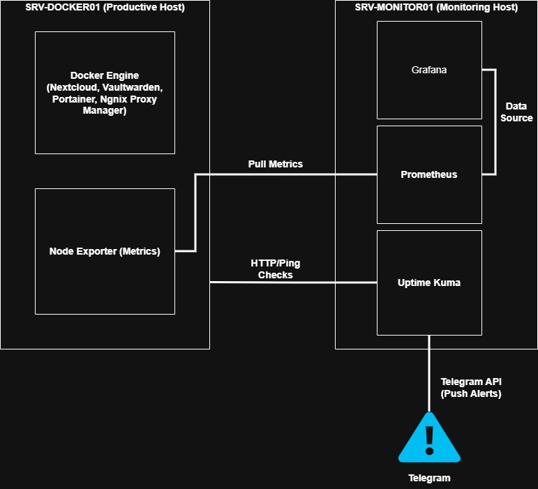
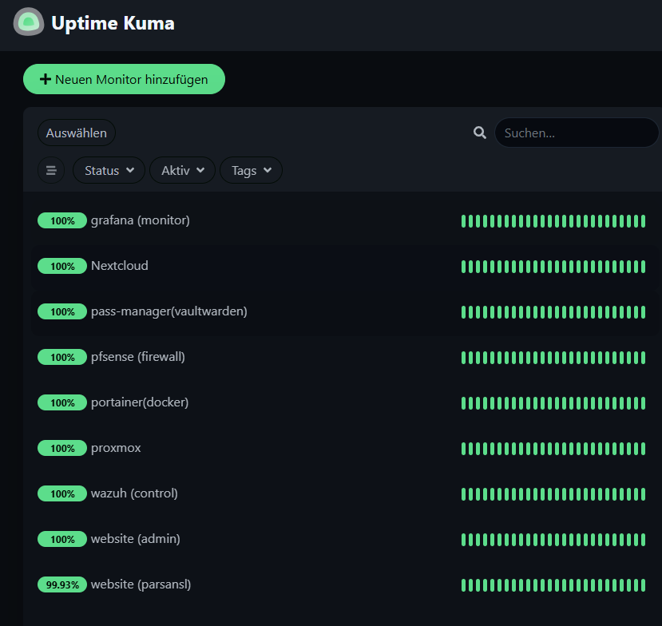
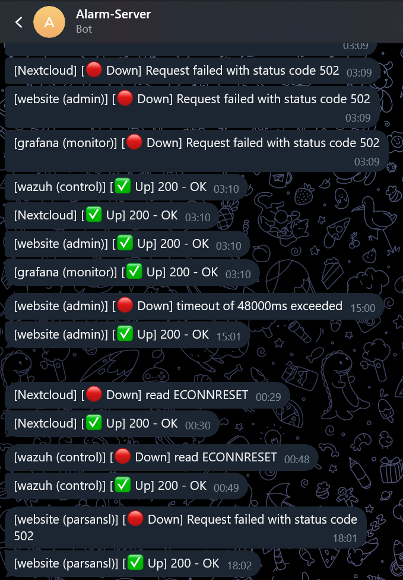
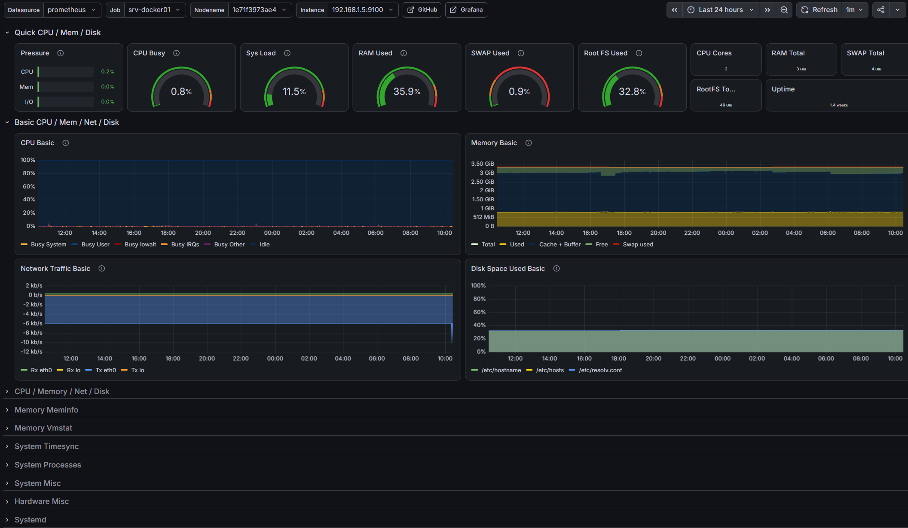

# Operations & Monitoring: Enterprise Observability Stack

Dieses Projekt dokumentiert den Aufbau eines zentralen Network Operations Center (NOC) zur proaktiven Überwachung der gesamten Server- und Container-Infrastruktur. Die Implementierung erfolgte strikt nach Enterprise-Best-Practices mit vollständiger Isolation der Monitoring-Dienste.

## Monitoring Architecture & Data Flow

Operations & Monitoring: Enterprise Observability Stack
Dieses Projekt dokumentiert den Aufbau eines zentralen Network Operations Center (NOC) zur proaktiven Überwachung der gesamten Server- und Container-Infrastruktur. Die Implementierung erfolgte strikt nach Enterprise-Best-Practices mit vollständiger Isolation der Monitoring-Dienste

-----------------------------------

Phase 1: Proaktives Monitoring & Alerting (Uptime Kuma)
Situation:
Mit der wachsenden Anzahl an kritischen Infrastrukturkomponenten (pfSense, Proxmox) und bereitgestellten Microservices (Nextcloud, Vaultwarden) entstand ein "Blind Spot". Ohne ein zentrales Überwachungssystem konnten Systemausfälle, Netzwerkprobleme oder fehlerhafte Container-Deployments erst reaktiv (durch manuelle Prüfung) festgestellt werden, was zu einer inakzeptablen Downtime führen kann.

Task:
Implementierung einer leichtgewichtigen, aber leistungsstarken Monitoring-Lösung. Das System musste vollständig isoliert vom produktiven Docker-Host laufen, um im Falle eines Ausfalls der Hauptsysteme weiterhin funktionsfähig zu bleiben. Zudem war ein Echtzeit-Alerting-System zwingend erforderlich, um Administratoren bei Ausfällen proaktiv zu benachrichtigen.

Action:

Deployment (Isolation): Bereitstellung von Uptime Kuma als Docker-Container auf einer dedizierten Monitoring-VM (SRV-MONITOR01), um einen Single Point of Failure zu vermeiden. Das Routing erfolgte gesichert über den Nginx Proxy Manager (kuma.parsansl.de).

ICMP Ping Checks (Layer-3): Einrichtung interner Heartbeat-Monitore für essentielle Netzwerkknoten (pfSense Gateway, Proxmox Host, Docker Host) zur Prüfung der grundlegenden Erreichbarkeit.

HTTP(s) Checks (Layer-7): Konfiguration von Application-Monitoren für die externen Webdienste (cloud.parsansl.de, pass.parsansl.de), um sicherzustellen, dass die Applikationen inklusive SSL-Terminierung korrekt antworten.

Alerting Integration: Registrierung eines dedizierten Telegram-Bots über die Telegram API. Die Bot-Token und Chat-IDs wurden sicher (als Secrets) in Uptime Kuma integriert, um bei Statusänderungen (UP/DOWN) sofortige Push-Benachrichtigungen auf mobile Endgeräte auszulösen.

Result:
Das Network Operations Center (NOC) ist nun voll funktionsfähig. Die Infrastruktur wird 24/7 lückenlos überwacht. Durch die proaktiven Telegram-Alerts wurde die Mean Time To Detect (MTTD) auf unter 60 Sekunden reduziert. Systemausfälle werden nun erkannt und gemeldet, bevor Endnutzer Einschränkungen bemerken, was die Zuverlässigkeit der gesamten IT-Umgebung drastisch erhöht.

** Uptime Kuma Dashboard:**

** Incident Alerting (Telegram API):**

-----------------------------------

Phase 2: Enterprise Performance Monitoring (Prometheus & Grafana)
Situation:
Nach der Etablierung des reaktiven Availability-Monitorings (Uptime Kuma) fehlte tiefergehende Transparenz über die Ressourcenauslastung (CPU, RAM, Disk I/O) der Server-Infrastruktur. Um Leistungsengpässe (Bottlenecks) zu identifizieren, bevor sie zu Systemausfällen führen, wurde ein proaktives Performance-Monitoring-System mit Langzeit-Metriken (Time-Series Data) benötigt.

Task:
Aufbau eines industriestandardisierten Monitoring-Stacks bestehend aus Node Exporter, Prometheus und Grafana. Die Architektur musste aus Sicherheitsgründen "Clean Code"-konform (mittels .env-Secrets) implementiert werden und durfte die Produktivsysteme nicht durch hohen Overhead belasten.

Action:

Metrik-Erfassung (Node Exporter): Installation des Prometheus Node Exporters als leichtgewichtiger Docker-Container auf dem produktiven Host (SRV-DOCKER01), um systemnahe Hardware- und OS-Metriken bereitzustellen.

Datenbank & Aggregation (Prometheus): Bereitstellung von Prometheus auf der dedizierten Monitoring-VM. Die Konfiguration (prometheus.yml) wurde als Pull-Modell eingerichtet, um Metriken sicher (via isolierter Docker-Netzwerke und dedizierter Ports) vom Host abzugreifen.

Datenvisualisierung & Secret Management (Grafana): Deployment von Grafana zur grafischen Aufbereitung der Zeitreihendaten. Sensible Zugangsdaten (GF_SECURITY_ADMIN_PASSWORD) und Port-Konfigurationen wurden konsequent über .env-Dateien injiziert. Anschließend wurde das offizielle Node Export er Full Dashboard importiert und mit der Prometheus-Datenquelle verknüpft.

Result:
Das Rechenzentrum verfügt nun über ein hochprofessionelles, visuelles NOC. Der Administrator hat Echtzeit-Einblick in alle kritischen Leistungsindikatoren der Server. Durch die strikte Trennung von Secrets (mittels .env) und die logische Isolation der Monitoring-Komponenten ist die Infrastruktur vollständig sicher, skalierbar und "Enterprise-ready".

** Enterprise Metrics Visualization (Grafana):**

## Projektabschluss & Fazit (Conclusion)
Die Implementierung dieses Observability-Stacks transformiert die IT-Infrastruktur von einem reaktiven in einen proaktiven Zustand. Die Kombination aus Uptime Kuma für sofortiges Incident-Alerting via Telegram und dem Prometheus/Grafana-Gespann für tiefgehende Performance-Analysen beweist ein starkes Verständnis für "Day-2-Operations" und Site Reliability Engineering (SRE). Das Setup ist ressourceneffizient, hochgradig sicher und garantiert die Zuverlässigkeit kritischer Unternehmensdienste.
